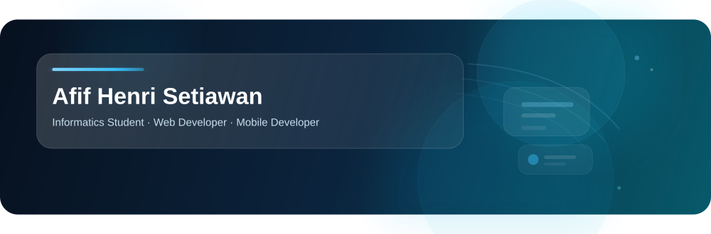

 

<h2>Fullstack Web & Mobile Developer</h2>

I'm Afif Henri Setiawan, an Informatics student and Fullstack Web & Mobile Developer.
I enjoy building web and mobile applications that are functional, user-friendly, and maintainable.
My main focus is web development with React, Next.js, Node.js, Express.js, NestJS, and Prisma,
while also exploring mobile development with Flutter.

 

 

---

##  Tech Stack

### Frontend

  

### Backend

  

### Database

  

### Mobile

  

### Tools

  

---

### 💭 Code. Build. Learn. Repeat. 🚀

 

  

Thanks for visiting my profile!

